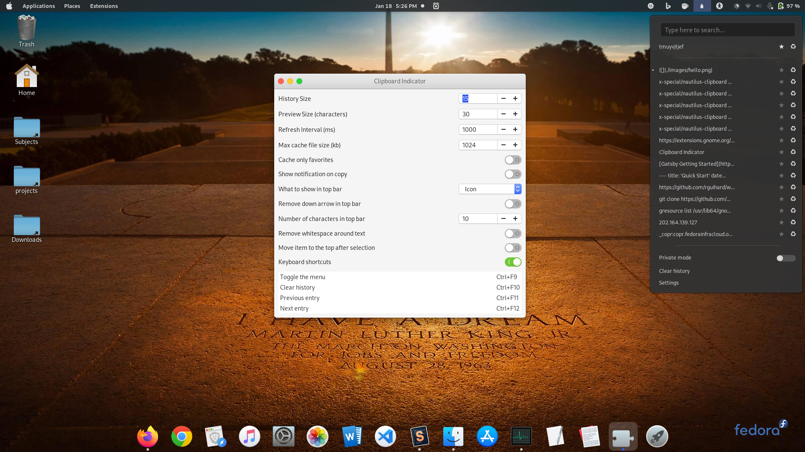

# User themes

## 1. [Clipboard Indicator](https://extensions.gnome.org/extension/779/clipboard-indicator/)

One of the most handy desktop extensions. Ever wanted to paste the content you copied earlier, but it got overwritten. Clipboard Indicator got you covered. It lets the user save multiple copied items ( >100). You just dont have to do anything else than installing it.

- Pin contents
- Persistent storage
- Search-in feature
- private mode
- fully customisable
- custom shortcuts

## 2. [GSConnect](https://extensions.gnome.org/extension/1319/gsconnect/)

The gnome alternative for kdeconnect. Very much useful if you are an android user. Lets you control your system from your android system and vice-versa through a local server (which means both have to be connected to same network).

- Run custom commands on your system from android mobile
- android system can act as virtual keyboard and mouse
- can sync files and clipboard
- custom keyboard shortcuts
- All-in-all controls and access every part securely
